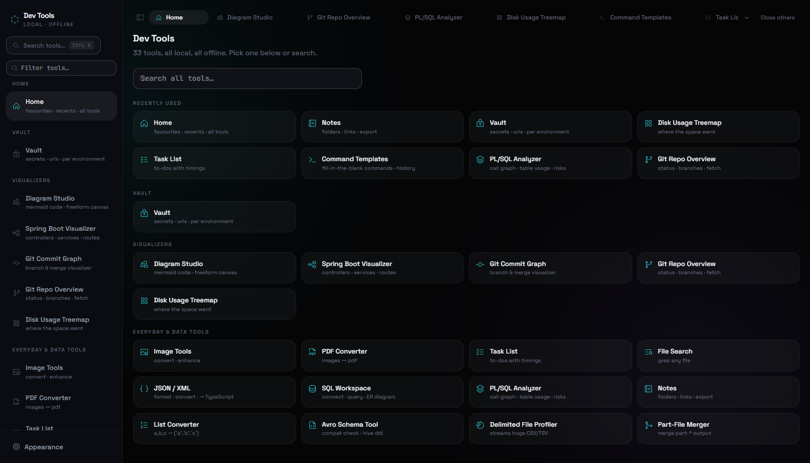
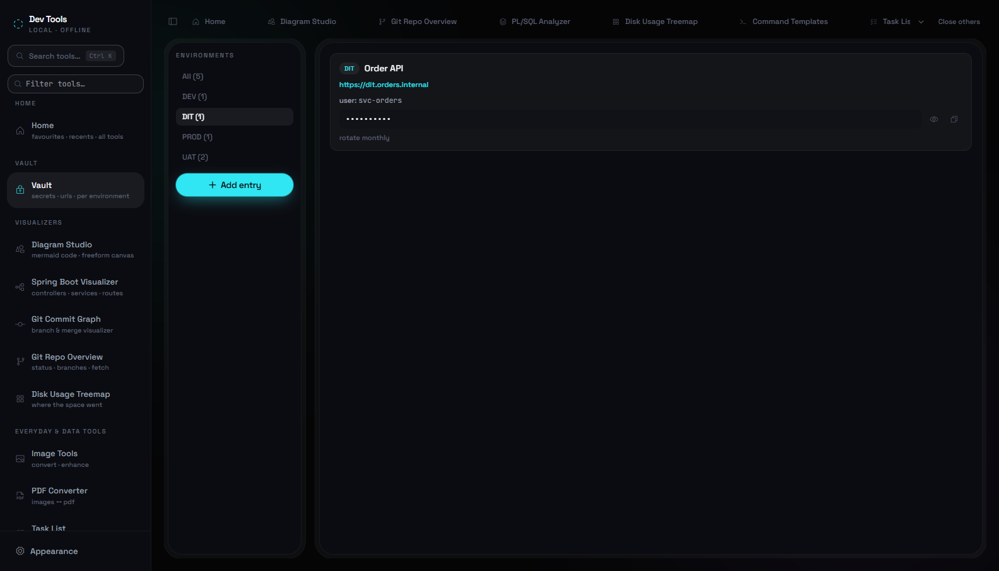
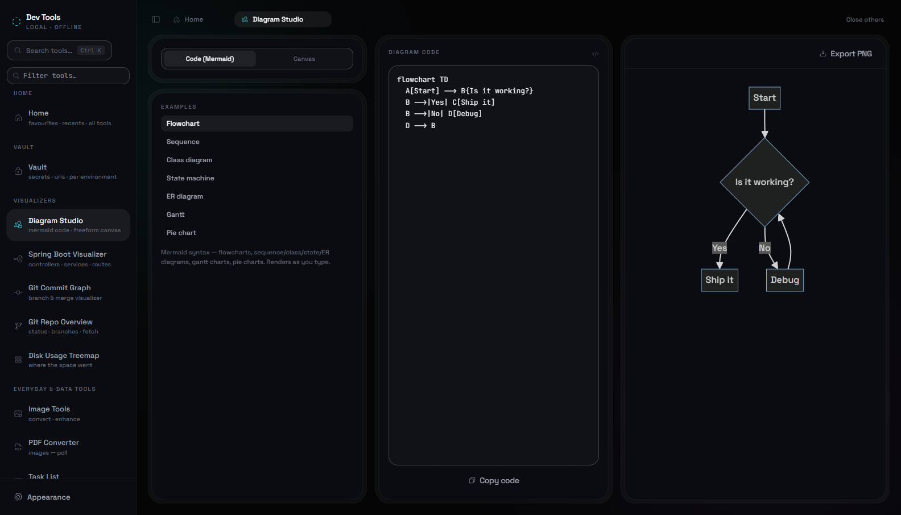
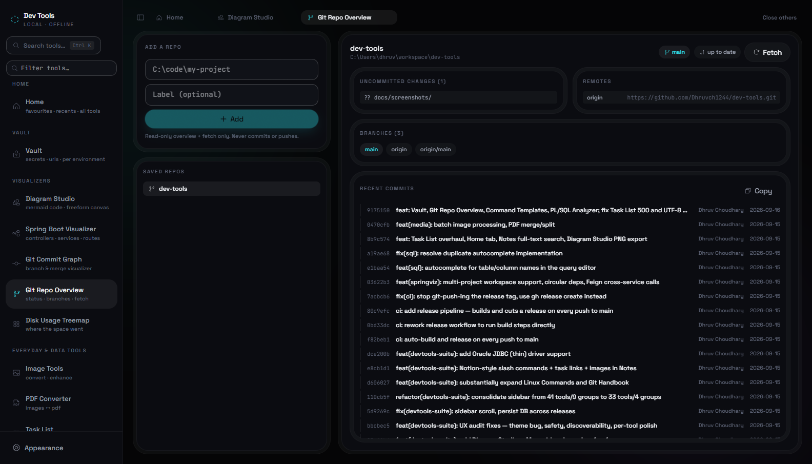
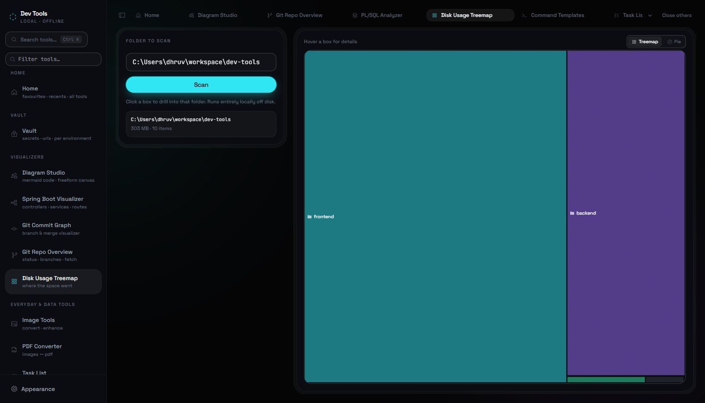
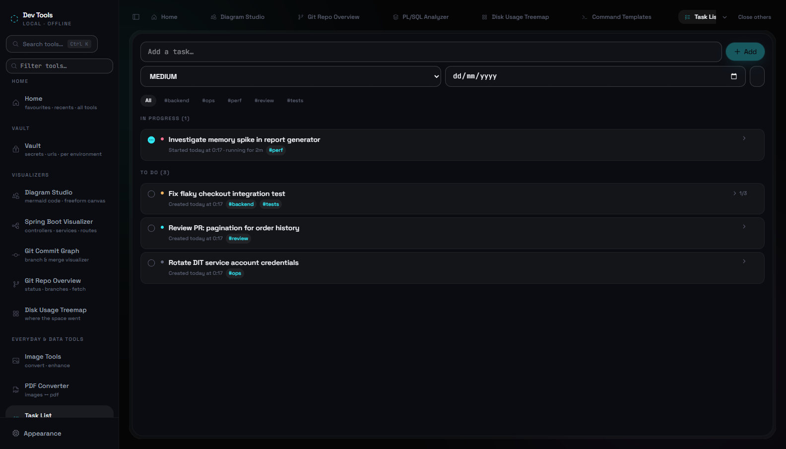
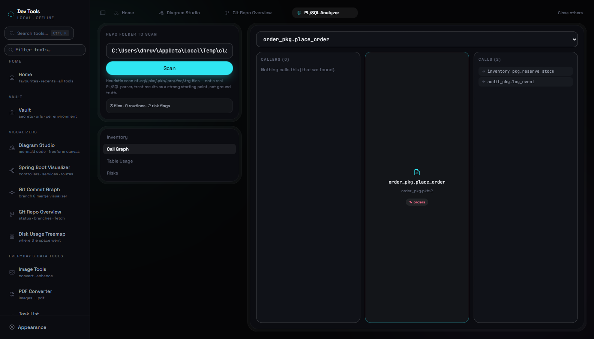
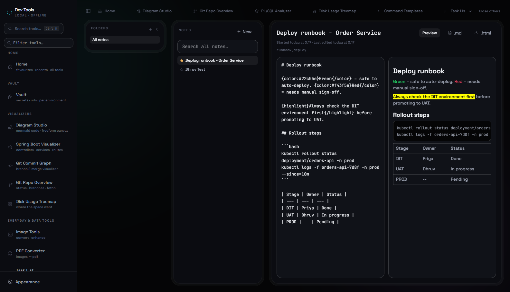
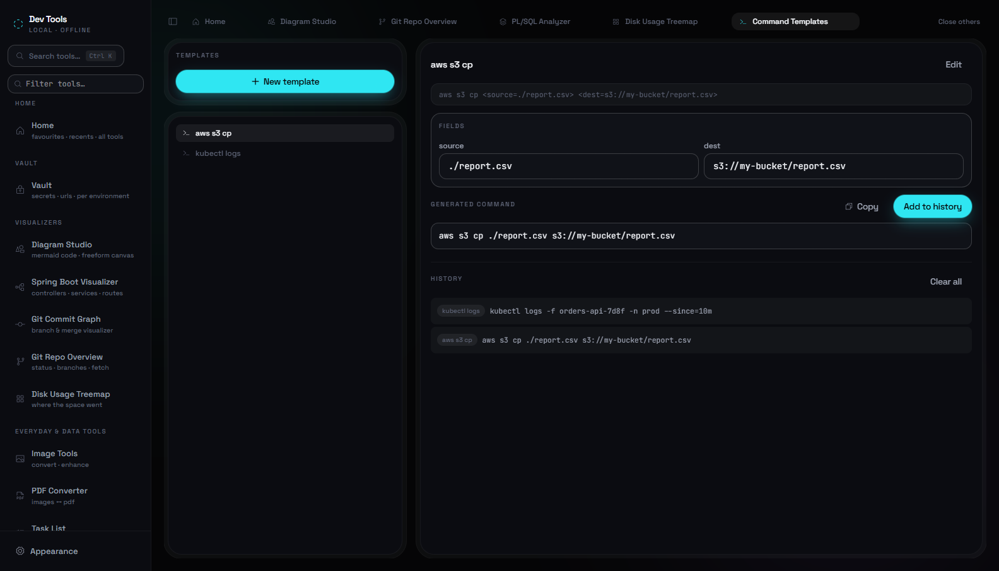

# Dev Tools Suite

A local, offline dev tools app: a Spring Boot repo visualizer, a heuristic PL/SQL
call-graph/table-usage mapper, a local secrets Vault, a read-only Git repo overview,
fill-in-the-blank Command Templates, DB/regex/cron/disk visual tools, everyday
Image/PDF tools, 40GB-scale file search, SQL Workspace, a Task List, Notes with
nested folders/backlinks/colors/syntax highlighting, and more — **32 tools**
across 5 sidebar groups, reachable via the sidebar, a filter box, or the Ctrl+K
command palette. Runs entirely on your machine as a single Java process — no
external services, no telemetry, no internet required after download.



## Vault

- **Vault** — local secrets/credentials/URLs, grouped by environment (DIT, SIT,
  UAT, PROD, or any name you use), pinned at the top of the sidebar since it's
  used constantly. Masked by default with a reveal toggle and one-click copy.
  Stored in the same local H2 database as everything else in this app — **plaintext,
  no encryption at rest** — appropriate for a trusted single-user local tool, not
  a substitute for a real secrets manager.



## Visualizers

- **Diagram Studio** — a draw.io-style diagram tool with two modes: a **code**
  mode where you write Mermaid syntax (flowcharts, sequence/class/state/ER
  diagrams, gantt charts, pie charts) and it renders live, and a **canvas** mode —
  a freeform whiteboard where you place rectangles/ellipses/diamonds/text, drag to
  move, drag-resize, connect shapes with arrows, recolor, and export to SVG or PNG.
  Canvas diagrams save by name locally for later.



- **Spring Boot Visualizer** — point it at a local Spring Boot project's source
  root (or a workspace of multiple sub-projects) and it statically parses the
  `.java` files (JavaParser, no compilation) to find
  `@RestController`/`@Service`/`@Repository`/`@Component` classes, draws a
  Controller → Service → Repository dependency graph from field/constructor
  injection, flags circular dependencies, follows `@FeignClient` cross-service
  calls, and lists every `@GetMapping`/`@PostMapping`/etc. endpoint as a real URL.
  Remembers recently analyzed projects.
- **Git Commit Graph** — paste the output of one `git log` command and see a real
  branch/merge graph with lane-colored commit lines, not just a flat list.
- **Git Repo Overview** — register a local repo path and get branch, ahead/behind,
  uncommitted files, branches, remotes, stash, and recent commits, plus a Fetch
  button. Read-only by design — there is no commit or push endpoint anywhere in
  the code, only a fixed set of read/fetch git subcommands. A repo with hundreds
  of branches doesn't get dumped in your face — by default only `main`/`master`,
  the current branch, and anything you've starred as a favourite are shown, with
  a filter box and "show all" toggle for the rest. Recent commits can switch
  between a flat list and a real lane-colored commit/merge graph.



- **Disk Usage Treemap** — scans a local folder and renders a squarified treemap
  (or a pie-chart view) of what's taking up space; common noise folders
  (`node_modules`, `.git`, `dist`, `target`, …) are greyed out instead of
  competing for attention. Click any box to drill into that subfolder.



## Everyday & Data Tools

- **Image Tools** — convert between PNG/JPG/BMP/GIF/WebP (read and write), or
  enhance (brightness, contrast, sharpen, resize/upscale). Batch mode processes
  multiple files into a zip. Runs server-side, offline.
- **PDF Converter** — assemble images into a PDF, render a PDF's pages back to a
  zip of images at a chosen DPI, merge multiple PDFs in order, or split one PDF
  into one file per page.
- **Task List** — a to-do list with priority, due dates, tags, and per-task
  checklists, that actually times you: records when a task was created, started,
  and completed, with elapsed duration shown per task.


- **File Search** — search across files up to 40GB, plain term or regex,
  case-sensitive toggle. Streams line-by-line so large files don't get loaded
  into memory. Copy any single matched line or all matches at once.
- **JSON / XML formatter** — pretty-prints valid JSON into a collapsible,
  color-coded tree or raw text. Invalid JSON still gets broken onto readable
  lines with the parse error shown. Same idea for XML/SOAP (XXE-safe DOM parse).
  Also converts JSON ↔ escaped JSON string, both directions.
- **SQL Workspace** — connect (Postgres, MySQL, SQLite, Oracle via JDBC thin
  URL) and query, with autocomplete for table/column names, an inline linter
  (missing WHERE, SELECT *, unbounded queries), an auto-generated chart for
  numeric results, a visual tree/step view for EXPLAIN plans, and an ER
  diagram tab.
- **PL/SQL Analyzer** — point it at a folder of `.sql`/`.pks`/`.pkb`/`.prc`/`.fnc`/
  `.trg` files and it builds a searchable inventory of every
  package/procedure/function/trigger/view, a call graph (pick a routine, see its
  callers and callees, including cross-package calls), a table read/write usage
  map, and flags risky patterns (dynamic SQL, swallowed exceptions, deprecated
  `(+)` outer joins, `SELECT *`). **This is a heuristic regex-based scanner, not
  a real PL/SQL grammar parser** — treat results as a strong starting point for
  exploring an unfamiliar codebase, not compiler-verified ground truth.


- **Notes** — nested, collapsible folder tree, `[[Wiki-link]]` backlinks,
  full-text search, markdown editor with sanitized live preview, colored/
  highlighted text, syntax-highlighted code blocks, created/last-edited
  timestamps, export to standalone `.md` or `.html`. Type `/` for a
  Notion-style command menu (tables, checklists, headings, quote, code block,
  bold/italic/strikethrough/inline-code/link, collapsible sections, divider,
  colors, image upload, link-a-task — inserts a live-status `[[task:ID]]`
  reference back to Task List), or just paste/drag an image straight into the
  editor — images upload to the backend and are referenced by URL, not embedded
  as base64, so the note body stays small and readable.


- **List Converter** — paste one item per line, get back `('a', 'b', 'c')` and
  `(a, b, c)`.
- **Avro Schema Tool** — paste a writer and reader schema, get a backward-
  compatibility check field-by-field, plus a generated Hive DDL from the writer
  schema.
- **Delimited File Profiler** — streams a huge CSV/TSV and profiles it (column
  types, null rates, distinct counts) without loading it all into memory.
- **Part-File Merger** — merges Hadoop/Spark-style `part-*` output files back
  into one.

## Text & Dev Utilities

- **Diff** — line-and-word diff between two texts, with a unified-diff-style
  summary and copy-to-clipboard. Differences highlight live in yellow directly
  in the Before/After panes as you type, not just in the results panel below.
- **Encode / Decode** — base64, JWT decode, and common hash functions.
- **Time Toolkit** — convert any date/time in any timezone (defaults to IST) to
  epoch/ISO/every other configured timezone at once, plus epoch↔ISO conversion,
  duration between two timestamps, and a cron expression explainer with a
  weekly heatmap and next-12-runs list. A live-ticking World Clock shows a
  stylized world map with day/night shading and a real-time table across ten
  major timezones.
- **Regex Lab** — test a pattern live against sample text, or see it broken down
  as a railroad-style diagram instead of a wall of escape characters.
- **Text Toolkit** — separate input/output panes; case conversion, line
  sort/dedupe/trim/reverse/number, find & replace, column extraction, word-wrap,
  and live stats (lines/words/chars).
- **Data Generator** — UUIDs, ULIDs, and other fake test data.
- **Command Templates** — write a command with placeholders like
  `aws s3 cp <source=./file.txt> <dest=s3://bucket/file.txt>`; each `<name>` or
  `<name=default>` becomes an editable field pre-filled with your mock value,
  live-renders the final command as you edit, and keeps a history of every
  generated command for reuse.



## Backend, Web & Ops

- **Stack Trace Analyzer** — collapses framework noise out of a pasted
  stack trace so the actual failure point stands out.
- **Dependency Tree** — visualizes a Maven/Gradle dependency tree.
- **Spring Config** — diffs two versions of a `.properties`/`.yml` config file.
- **JAR Inspector** — inspects a JAR's manifest, class file versions (correctly
  labeled across every Java version, not just 5–8), resource files by type, the
  largest entries, top packages by class count, signed/multi-release detection,
  and duplicate classes across multiple jars.
- **top / ps Analyzer** — sorts and diffs pasted `top`/`ps` snapshots to spot
  what changed.
- **Reference Handbook** — Linux command builder, Makefile explainer, and Git
  handbook (categorized commands, "how do I…" recipes) in one tabbed tool.
- **Bundle Stats** — loads a webpack/rollup/vite/Angular `stats.json` and shows
  what's inflating the bundle, largest assets first.
- **CORS Checker** — explains why a cross-origin request's preflight failed.
- **AWS Helpers** — ARN parsing, IAM policy helpers, certificate inspection.

## Shared app features

- **Home tab** — pinned favourites, recently used tools, and a full searchable
  tool directory.
- **History** — every run is saved locally (embedded H2 file database) per
  tool; click any entry to reload it back into the input.
- **Appearance** — pick a coding font with real ligatures (JetBrains Mono,
  Fira Code, Victor Mono) and a color theme: 5 light themes (Light, Solarized
  Light, Catppuccin Latte, One Light, Nord Light) and 11 dark ones (Void,
  Dracula, Nord, Tokyo Night, Gruvbox, Catppuccin, Solarized, Monokai Pro, One
  Dark, Rosé Pine, Everforest). Both persist across restarts.
- **Ctrl+K command palette** — jump to any tool without touching the sidebar.

## Running it

Requires Java 17+ on the machine running the jar (nothing else).

```
run.bat
```

This starts `backend/target/devtools-suite.jar` and opens your browser to
`http://localhost:8383`. Close the "Dev Tools Suite" console window to stop it.

Notes/Tasks/Vault/SQL connections & saved queries/history live in an H2 database
at `%USERPROFILE%\.devtools-suite\` — not next to the jar — so downloading a new
release (a new extracted folder) never loses your data. If you have an older
release with `devtools-history.mv.db` sitting next to `run.bat`, the first run
of a new version copies it into the new location automatically.

## Building from source

Requires Node.js and Maven in addition to Java 17+.

```
build.bat
```

This builds the React frontend, copies it into the Spring Boot backend's
static resources, and packages everything into one runnable jar at
`backend/target/devtools-suite.jar`.

## Stack

- Backend: Java 17, Spring Boot 3, embedded H2 (file-based) for history/notes/
  tasks/vault, JavaParser for Spring Boot static analysis, PDFBox for PDF work,
  a `webp-imageio` plugin for WebP support, and a fixed-command git wrapper for
  Git Repo Overview (shells out to the system `git`, no arbitrary-command
  endpoint exists).
- Frontend: React + TypeScript + Vite, Tailwind CSS, Framer Motion, Phosphor
  Icons, `marked` + DOMPurify + `highlight.js` for Notes. Fonts and icons are
  self-hosted (no CDN), so the packaged jar works fully offline.

## Known limitations

- **PL/SQL Analyzer** is a regex-based heuristic scanner, not a real grammar
  parser — good for exploration, not a source of truth.
- **Vault** stores secrets in plaintext locally — not encrypted at rest.
- **Command Templates**, **Vault**, and **Git Repo Overview** are new this cycle
  and have been smoke-tested (CRUD round-trips, live scans against real repos)
  but not used in anger over time yet.
